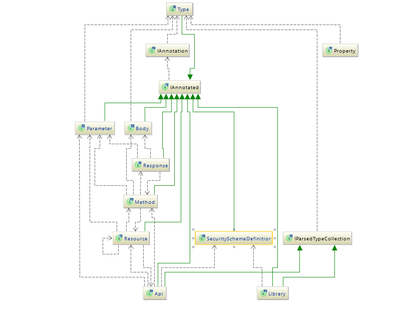

# RAML HTTP DOMAIN MODEL

RAML is a language for the definition of HTTP-based APIs that embody most or all of the principles of Representational State Transfer (REST)

-----

This repository contains set of interfaces devoted to represent semantic of RAML files. It does not contains syntactic or modularity abstractions like *Overlays* and *Traits* and is fully devoted to representing HTTP interfaces described in RAML documents.

Major interfaces:

